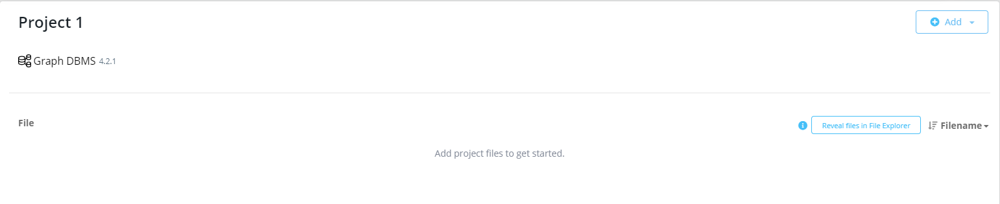

# How to export your Neo4j Database to JSON/Cypher file from Neo4j Desktop using APOC

*Tested on Windows 10 64-bit, Neo4jDesktop 1.4.5 and APOC 4.2.0.0*

[Step 1: Install APOC](#step-1-install-apoc)

[Step 2: Add permission to importexport files](#step-2-add-permission-to-importexport-files)

[Step 3: Export your database](#step-3-export-your-database)

[Can't find .Neo4jDesktop directory?](#cant-find-neo4jdesktop-directory)

[Can't find your [project-dir-hash] ?](#cant-find-your-project-dir-hash)

***

## Step 1: Install APOC

If you haven't already, you need to install APOC First.

*Important note: These steps apply to individual database, not for the whole system. You need to manually add APOC to **every** database where you want to use APOC.*

1. Open Neo4jDesktop.
2. Locate the database you want to export in your project section.

   
3. Click on the database. **Details** panel should appear.

   
4. Click on the **Plugins** tab and expand **APOC**.

   
5. Wait until the app is checking for compatibile version.
6. After the compatibile version of APOC is found, the green button **Install** will appear. Click the button to install APOC.

   
7. Wait until the installation is completed
   ___ 
8. Installation is completed when you are able to see APOC version with green check icon.

   


## Step 2: Add permission to import/export files

1. Locate the database you want to export in your project section.
2. Click **three dots icon** near the database Start/Open buttons. Then click **Settings**. 

   
3. Text window will appear. Go at the end of the text file by scrolling down.

   
4. At the end of the file paste this code fragment:
    ```
    apoc.import.file.enabled=true
    apoc.export.file.enabled=true
    ```
5. The file should look like shown below. Accept changes by clicking **Apply** and close the window.

   
6. Now the APOC will be able to perform import/export tasks on your database. 

*Remember: Settings shown in steps 1 and 2 are applied to one database individually. If you want to perform import/export operations on multiple databases, you need to apply these settings individually for each of them.*

## Step 3: Export your database

0. Make sure you have installed APOC (Step 1) and enabled import/export operations (Step 2).
1. Locate the database you want to export in your project section.
2. Start your database.

    
3. Open the database via Neo4j Browser.

   

*Commands shown below should be performed in the Neo4j command window at the top of Neo4j Browser.*


### Exporting database to Cypher

4. Perform this command in command window:
   ```cypher
   CALL apoc.export.cypher.all("mydb.cypher",{})
   ```

### Exporting database to JSON

4. Perform this command in command window:
   ```cypher
   CALL apoc.export.json.all("mydb.json", {});
   ```

---

5. The results of both JSON/Cypher exports should be similar as shown below (no error should occur).

   

### Find export files in the filesystem

Usually the files are within your project files in .Neo4jDesktop directory.
It is often under location `C:/Users/Admin/.Neo4jDesktop/relate-data/dbmss/[project-dir-hash]/import`

## Can't find .Neo4jDesktop directory?

Note that the name of the directory starts with `.` which means it's hidden. You should enable visibility for hidden directories in your system.

Sometimes this directory can be under other locations than `C:/Users/Admin/`, for example `C:/Users/Admin/Documents`

## Can't find your [project-dir-hash] ?

If you don't know which directory in `/relate-data/dbmss/` is connected to your project, you can simply search for `mydb.cypher` or `mydb.json` files.

Other way to find your folder is to go to *Step 2.3* and find your name of the service.

```
# Name of the service
dbms.windows_service_name=neo4j-relate-dbms-[YOUR HASH WILL BE HERE]
                                             ^^^^^^^^^^^^^^^^^^^^^^
```

With that information you can find your directory name.


[Go to the top of the page](#how-to-export-your-neo4j-database-to-jsoncypher-file-from-neo4j-desktop-using-apoc)